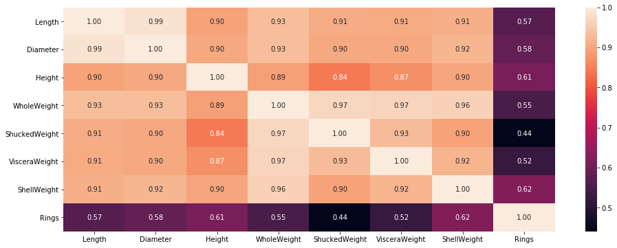

# Data Science Python Notebooks
This repository is a compilation of Jupyter Notebooks of simple machine learning and data science projects

## List of projects
1. [Classification](https://github.com/ABBigot/Notebooks/tree/master/Classification)
   - [Classification task on cancer-RNA dataset](blob/master/Classification/cancer-RNA-Classification.ipynb) - 
      Predicting the most significant genes for different types of tumors (BRCA, KIRC, COAD, LUAD and PRAD)
      
2. [Regression](https://github.com/ABBigot/Notebooks/tree/master/Regression)
   - [Linear regression on Abalone dataset](blob/master/Regressions/Abalone_LinearRegression.ipynb) - Predicting the age of an abalone based on its attributes
      
      
      
